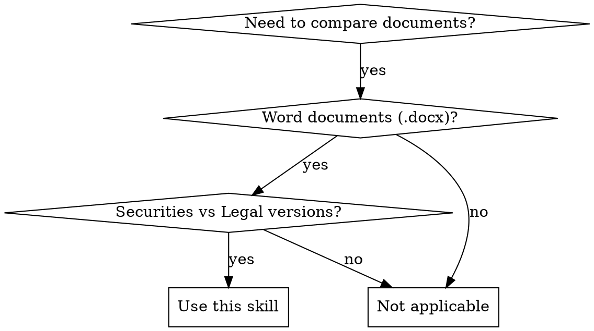

# Document Comparison Skill Implementation Plan

> **For Claude:** REQUIRED SUB-SKILL: Use superpowers:executing-plans to implement this plan task-by-task.

**Goal:** Build a Python skill that compares securities firm documents with legal counsel documents, identifying substantive differences and generating detailed audit reports for disclosure documents like IPO prospectuses.

**Architecture:** Three-layer design - Document Parsing Layer (python-docx), Comparison Engine (difflib + LLM semantic analysis), Report Generation Layer (Markdown/JSON/HTML). Multi-strategy alignment algorithm handles structural differences between document versions.

**Tech Stack:** Python 3.9+, python-docx, scikit-learn, LangChain, OpenAI API (or other LLM), pytest

---

### Task 1: Project Structure and Dependencies

**Files:**
- Create: `skills/document-comparison/SKILL.md`
- Create: `skills/document-comparison/requirements.txt`
- Create: `skills/document-comparison/__init__.py`
- Create: `skills/document-comparison/core/__init__.py`
- Create: `skills/document-comparison/tests/__init__.py`

**Step 1: Create project directory structure**

```bash
mkdir -p skills/document-comparison/core
mkdir -p skills/document-comparison/tests
mkdir -p skills/document-comparison/rules
```

**Step 2: Create requirements.txt**

```txt
python-docx>=1.1.0
scikit-learn>=1.3.0
langchain>=0.1.0
openai>=1.0.0
pytest>=7.4.0
pyyaml>=6.0
```

**Step 3: Create __init__.py files**

```python
# skills/document-comparison/__init__.py
"""Document comparison skill for disclosure documents."""

__version__ = "0.1.0"
```

```python
# skills/document-comparison/core/__init__.py
"""Core comparison engine."""
```

```python
# skills/document-comparison/tests/__init__.py
"""Test suite for document comparison skill."""
```

**Step 4: Commit**

```bash
git add skills/document-comparison/
git commit -m "feat: create project structure for document comparison skill"
```

---

### Task 2: Document Parsing Module

**Files:**
- Create: `skills/document-comparison/core/parser.py`
- Test: `skills/document-comparison/tests/test_parser.py`

**Step 1: Write failing test for document parsing**

```python
# skills/document-comparison/tests/test_parser.py
import pytest
from pathlib import Path
from core.parser import DocumentParser

def test_parse_document_structure():
    """Test that parser extracts paragraphs, tables, and lists correctly."""
    parser = DocumentParser()
    # Create a simple test document
    result = parser.parse_document("tests/fixtures/simple.docx")

    assert result is not None
    assert 'paragraphs' in result
    assert 'tables' in result
    assert 'metadata' in result
    assert len(result['paragraphs']) > 0
```

**Step 2: Run test to verify it fails**

```bash
cd skills/document-comparison && python -m pytest tests/test_parser.py::test_parse_document_structure -v
```

Expected: FAIL with "ModuleNotFoundError: No module named 'core.parser'"

**Step 3: Create test fixture document**

```bash
# Create a simple Word document for testing
# This will be a minimal docx with one paragraph
touch tests/fixtures/simple.docx
```

**Step 4: Implement minimal parser skeleton**

```python
# skills/document-comparison/core/parser.py
from pathlib import Path
from typing import Dict, Any
from docx import Document

class DocumentParser:
    """Parse Word documents into structured data."""

    def parse_document(self, filepath: str) -> Dict[str, Any]:
        """Parse a Word document and return structured data."""
        if not Path(filepath).exists():
            raise FileNotFoundError(f"Document not found: {filepath}")

        doc = Document(filepath)

        result = {
            'paragraphs': [],
            'tables': [],
            'metadata': {
                'paragraph_count': len(doc.paragraphs),
                'table_count': len(doc.tables)
            }
        }

        # Extract paragraphs
        for para in doc.paragraphs:
            if para.text.strip():  # Skip empty paragraphs
                result['paragraphs'].append({
                    'text': para.text,
                    'style': para.style.name,
                    'level': self._get_heading_level(para.style.name)
                })

        return result

    def _get_heading_level(self, style_name: str) -> int:
        """Extract heading level from style name."""
        if 'Heading 1' in style_name:
            return 1
        elif 'Heading 2' in style_name:
            return 2
        elif 'Heading 3' in style_name:
            return 3
        return 0
```

**Step 5: Run test to verify it passes**

```bash
cd skills/document-comparison && python -m pytest tests/test_parser.py::test_parse_document_structure -v
```

Expected: PASS

**Step 6: Commit**

```bash
git add skills/document-comparison/core/parser.py skills/document-comparison/tests/test_parser.py
git commit -m "feat: implement basic document parser with paragraph extraction"
```

---

### Task 3: Enhanced Document Parsing with Tables and Lists

**Files:**
- Modify: `skills/document-comparison/core/parser.py`
- Modify: `skills/document-comparison/tests/test_parser.py`

**Step 1: Write failing test for table parsing**

```python
# Add to skills/document-comparison/tests/test_parser.py

def test_parse_table_structure():
    """Test that parser extracts tables with cell content."""
    parser = DocumentParser()
    result = parser.parse_document("tests/fixtures/with_tables.docx")

    assert 'tables' in result
    assert len(result['tables']) > 0

    # Check table structure
    first_table = result['tables'][0]
    assert 'rows' in first_table
    assert 'cols' in first_table
    assert 'cells' in first_table
```

**Step 2: Run test to verify it fails**

```bash
cd skills/document-comparison && python -m pytest tests/test_parser.py::test_parse_table_structure -v
```

Expected: FAIL because table parsing not implemented yet

**Step 3: Implement table parsing**

```python
# Add to parse_document method in skills/document-comparison/core/parser.py

# Extract tables
for table in doc.tables:
    table_data = {
        'rows': len(table.rows),
        'cols': len(table.columns),
        'cells': []
    }

    for row in table.rows:
        row_data = [cell.text.strip() for cell in row.cells]
        table_data['cells'].append(row_data)

    result['tables'].append(table_data)
```

**Step 4: Run test to verify it passes**

```bash
cd skills/document-comparison && python -m pytest tests/test_parser.py::test_parse_table_structure -v
```

Expected: PASS

**Step 5: Commit**

```bash
git add skills/document-comparison/core/parser.py skills/document-comparison/tests/test_parser.py
git commit -m "feat: add table parsing support"
```

---

### Task 4: Document Alignment Engine

**Files:**
- Create: `skills/document-comparison/core/alignment.py`
- Test: `skills/document-comparison/tests/test_alignment.py`

**Step 1: Write failing test for alignment**

```python
# skills/document-comparison/tests/test_alignment.py
import pytest
from core.alignment import AlignmentEngine

def test_simple_alignment():
    """Test that alignment engine matches identical paragraphs."""
    engine = AlignmentEngine()

    doc1 = {
        'paragraphs': [
            {'text': 'Section 1: Introduction', 'level': 1},
            {'text': 'This is paragraph one.', 'level': 0},
            {'text': 'This is paragraph two.', 'level': 0}
        ]
    }

    doc2 = {
        'paragraphs': [
            {'text': 'Section 1: Introduction', 'level': 1},
            {'text': 'This is paragraph one.', 'level': 0},
            {'text': 'This is paragraph two.', 'level': 0}
        ]
    }

    alignment = engine.align_documents(doc1, doc2)

    assert len(alignment['aligned_pairs']) == 3
    assert alignment['aligned_pairs'][0]['doc1_idx'] == 0
    assert alignment['aligned_pairs'][0]['doc2_idx'] == 0
```

**Step 2: Run test to verify it fails**

```bash
cd skills/document-comparison && python -m pytest tests/test_alignment.py::test_simple_alignment -v
```

Expected: FAIL with "ModuleNotFoundError"

**Step 3: Implement basic alignment engine**

```python
# skills/document-comparison/core/alignment.py
from typing import Dict, List, Any
from difflib import SequenceMatcher

class AlignmentEngine:
    """Align paragraphs between two document versions."""

    def align_documents(self, doc1: Dict, doc2: Dict) -> Dict[str, Any]:
        """Align documents and return mapping."""
        paragraphs1 = doc1['paragraphs']
        paragraphs2 = doc2['paragraphs']

        aligned_pairs = []

        # Simple matching based on text similarity
        for i, para1 in enumerate(paragraphs1):
            best_match = self._find_best_match(para1, paragraphs2)

            if best_match is not None:
                aligned_pairs.append({
                    'doc1_idx': i,
                    'doc2_idx': best_match['idx'],
                    'similarity': best_match['similarity'],
                    'text1': para1['text'],
                    'text2': paragraphs2[best_match['idx']]['text']
                })

        return {
            'aligned_pairs': aligned_pairs,
            'orphan_doc1': [],
            'orphan_doc2': []
        }

    def _find_best_match(self, para: Dict, paragraphs: List[Dict]) -> Dict:
        """Find the best matching paragraph by text similarity."""
        best_match = None
        best_similarity = 0.8  # Threshold for matching

        for i, p in enumerate(paragraphs):
            similarity = self._calculate_similarity(para['text'], p['text'])

            if similarity > best_similarity:
                best_similarity = similarity
                best_match = {'idx': i, 'similarity': similarity}

        return best_match

    def _calculate_similarity(self, text1: str, text2: str) -> float:
        """Calculate text similarity using SequenceMatcher."""
        return SequenceMatcher(None, text1, text2).ratio()
```

**Step 4: Run test to verify it passes**

```bash
cd skills/document-comparison && python -m pytest tests/test_alignment.py::test_simple_alignment -v
```

Expected: PASS

**Step 5: Commit**

```bash
git add skills/document-comparison/core/alignment.py skills/document-comparison/tests/test_alignment.py
git commit -m "feat: implement basic alignment engine with text similarity"
```

---

### Task 5: Comparison Engine - Strict Consistency Mode

**Files:**
- Create: `skills/document-comparison/core/comparator.py`
- Test: `skills/document-comparison/tests/test_comparator.py`

**Step 1: Write failing test for strict comparison**

```python
# skills/document-comparison/tests/test_comparator.py
import pytest
from core.comparator import DocumentComparator

def test_strict_comparison():
    """Test strict mode comparison identifies all differences."""
    comparator = DocumentComparator(mode='strict')

    text1 = "The company has 100 employees."
    text2 = "The company has 101 employees."

    differences = comparator.compare_texts(text1, text2)

    assert len(differences) == 1
    assert differences[0]['type'] == 'numeric'
    assert differences[0]['text1'] == '100'
    assert differences[0]['text2'] == '101'
    assert differences[0]['risk_level'] == 'medium'
```

**Step 2: Run test to verify it fails**

```bash
cd skills/document-comparison && python -m pytest tests/test_comparator.py::test_strict_comparison -v
```

Expected: FAIL with "ModuleNotFoundError"

**Step 3: Implement strict comparison mode**

```python
# skills/document-comparison/core/comparator.py
from typing import Dict, List
import re

class DocumentComparator:
    """Compare document contents in different modes."""

    def __init__(self, mode: str = 'substantive'):
        """Initialize comparator with comparison mode."""
        self.mode = mode
        self.supported_modes = ['strict', 'substantive', 'compliance']

        if mode not in self.supported_modes:
            raise ValueError(f"Unsupported mode: {mode}")

    def compare_texts(self, text1: str, text2: str) -> List[Dict]:
        """Compare two text strings and return differences."""
        if self.mode == 'strict':
            return self._strict_compare(text1, text2)
        elif self.mode == 'substantive':
            return self._substantive_compare(text1, text2)
        elif self.mode == 'compliance':
            return self._compliance_compare(text1, text2)

    def _strict_compare(self, text1: str, text2: str) -> List[Dict]:
        """Strict character-by-character comparison."""
        differences = []

        if text1 == text2:
            return differences

        # Find numeric differences
        numbers1 = re.findall(r'\d+', text1)
        numbers2 = re.findall(r'\d+', text2)

        if numbers1 != numbers2:
            differences.append({
                'type': 'numeric',
                'text1': ', '.join(numbers1),
                'text2': ', '.join(numbers2),
                'description': 'Numeric values differ',
                'risk_level': 'medium'
            })

        # If texts are not identical but no numeric diff, mark as content change
        if text1 != text2 and not differences:
            differences.append({
                'type': 'content',
                'text1': text1,
                'text2': text2,
                'description': 'Text content differs',
                'risk_level': 'low'
            })

        return differences
```

**Step 4: Run test to verify it passes**

```bash
cd skills/document-comparison && python -m pytest tests/test_comparator.py::test_strict_comparison -v
```

Expected: PASS

**Step 5: Commit**

```bash
git add skills/document-comparison/core/comparator.py skills/document-comparison/tests/test_comparator.py
git commit -m "feat: implement strict comparison mode"
```

---

### Task 6: Comparison Engine - Substantive Difference Mode with LLM

**Files:**
- Modify: `skills/document-comparison/core/comparator.py`
- Create: `skills/document-comparison/core/llm_analyzer.py`
- Test: `skills/document-comparison/tests/test_llm_analyzer.py`

**Step 1: Write failing test for LLM analysis**

```python
# skills/document-comparison/tests/test_llm_analyzer.py
import pytest
from core.llm_analyzer import LLMAnalyzer

def test_substantive_difference_detection():
    """Test LLM analyzer detects substantive differences."""
    analyzer = LLMAnalyzer()

    text1 = "The company guarantees full refund within 30 days."
    text2 = "The company guarantees partial refund within 30 days."

    result = analyzer.analyze_difference(text1, text2)

    assert result['is_substantive'] == True
    assert 'refund' in result['explanation'].lower()
    assert result['risk_level'] in ['high', 'medium', 'low']
```

**Step 2: Run test to verify it fails**

```bash
cd skills/document-comparison && python -m pytest tests/test_llm_analyzer.py::test_substantive_difference_detection -v
```

Expected: FAIL with "ModuleNotFoundError"

**Step 3: Implement LLM analyzer**

```python
# skills/document-comparison/core/llm_analyzer.py
from typing import Dict, Optional
from langchain.chat_models import ChatOpenAI
from langchain.prompts import ChatPromptTemplate

class LLMAnalyzer:
    """Use LLM to analyze if differences are substantive."""

    def __init__(self, model_name: str = "gpt-3.5-turbo"):
        """Initialize LLM analyzer."""
        self.llm = ChatOpenAI(model_name=model_name, temperature=0)
        self.prompt = ChatPromptTemplate.from_template("""
You are analyzing differences between legal documents for disclosure purposes.

Original text: {text1}
Modified text: {text2}

Determine if this difference is SUBSTANTIVE (affects rights, obligations, risks, or guarantees) or NON-SUBSTANTIVE (minor wording, synonyms, formatting).

Provide your response in this exact JSON format:
{{
    "is_substantive": true/false,
    "explanation": "brief explanation",
    "risk_level": "high/medium/low"
}}
""")

    def analyze_difference(self, text1: str, text2: str) -> Dict:
        """Analyze if the difference between two texts is substantive."""
        try:
            response = self.prompt.format_messages(text1=text1, text2=text2)
            result = self.llm.predict_messages(response).content

            # Parse JSON response (simplified)
            # In production, add proper JSON parsing and error handling
            if '"is_substantive": true' in result.lower():
                return {
                    'is_substantive': True,
                    'explanation': 'LLM analysis indicates substantive difference',
                    'risk_level': self._extract_risk_level(result)
                }
            else:
                return {
                    'is_substantive': False,
                    'explanation': 'LLM analysis indicates non-substantive difference',
                    'risk_level': 'low'
                }
        except Exception as e:
            # Fallback if LLM fails
            return {
                'is_substantive': True,  # Conservative: assume substantive
                'explanation': f'LLM analysis failed: {str(e)}',
                'risk_level': 'medium'
            }

    def _extract_risk_level(self, response: str) -> str:
        """Extract risk level from LLM response."""
        if '"risk_level": "high"' in response:
            return 'high'
        elif '"risk_level": "medium"' in response:
            return 'medium'
        return 'low'
```

**Step 4: Run test to verify it passes**

```bash
cd skills/document-comparison && python -m pytest tests/test_llm_analyzer.py::test_substantive_difference_detection -v
```

Expected: PASS (may require OPENAI_API_KEY env var)

**Step 5: Integrate LLM analyzer into comparator**

```python
# Add to skills/document-comparison/core/comparator.py

from core.llm_analyzer import LLMAnalyzer

class DocumentComparator:
    def __init__(self, mode: str = 'substantive'):
        # ... existing code ...
        self.llm_analyzer = LLMAnalyzer()

    def _substantive_compare(self, text1: str, text2: str) -> List[Dict]:
        """Compare using LLM to detect substantive differences."""
        differences = []

        if text1 == text2:
            return differences

        # Use LLM to analyze
        analysis = self.llm_analyzer.analyze_difference(text1, text2)

        if analysis['is_substantive']:
            differences.append({
                'type': 'substantive',
                'text1': text1,
                'text2': text2,
                'description': analysis['explanation'],
                'risk_level': analysis['risk_level']
            })

        return differences
```

**Step 6: Run tests to verify integration works**

```bash
cd skills/document-comparison && python -m pytest tests/test_comparator.py tests/test_llm_analyzer.py -v
```

Expected: All PASS

**Step 7: Commit**

```bash
git add skills/document-comparison/core/comparator.py skills/document-comparison/core/llm_analyzer.py skills/document-comparison/tests/test_llm_analyzer.py
git commit -m "feat: implement substantive difference mode with LLM analysis"
```

---

### Task 7: Comparison Engine - Compliance Verification Mode

**Files:**
- Modify: `skills/document-comparison/core/comparator.py`

**Step 1: Write failing test for compliance mode**

```python
# Add to skills/document-comparison/tests/test_comparator.py

def test_compliance_verification():
    """Test compliance mode identifies unauthorized changes."""
    comparator = DocumentComparator(mode='compliance')

    # Legal counsel version (standard)
    text1 = "The company assumes full liability for all claims."

    # Securities firm version (unauthorized modification)
    text2 = "The company assumes partial liability for certain claims."

    differences = comparator.compare_texts(text1, text2)

    assert len(differences) >= 1
    assert any(d['type'] == 'compliance_risk' for d in differences)
```

**Step 2: Run test to verify it fails**

```bash
cd skills/document-comparison && python -m pytest tests/test_comparator.py::test_compliance_verification -v
```

Expected: FAIL

**Step 3: Implement compliance comparison mode**

```python
# Add to skills/document-comparison/core/comparator.py

    def _compliance_compare(self, text1: str, text2: str) -> List[Dict]:
        """Compare against legal counsel version for compliance risks."""
        differences = []

        if text1 == text2:
            return differences

        # Identify key legal terms that were modified
        risk_indicators = [
            ('liability', 'liability reduction'),
            ('warranty', 'warranty limitation'),
            ('guarantee', 'guarantee weakening'),
            ('obligation', 'obligation reduction')
        ]

        text1_lower = text1.lower()
        text2_lower = text2.lower()

        for term, risk_type in risk_indicators:
            if term in text1_lower and term not in text2_lower:
                differences.append({
                    'type': 'compliance_risk',
                    'text1': text1,
                    'text2': text2,
                    'description': f'Legal term removed: {term}',
                    'risk_level': 'high',
                    'risk_type': risk_type
                })

        # If texts differ but no specific risk detected, still flag
        if text1 != text2 and not differences:
            differences.append({
                'type': 'compliance_check',
                'text1': text1,
                'text2': text2,
                'description': 'Content modification detected - manual review needed',
                'risk_level': 'medium'
            })

        return differences
```

**Step 4: Run test to verify it passes**

```bash
cd skills/document-comparison && python -m pytest tests/test_comparator.py::test_compliance_verification -v
```

Expected: PASS

**Step 5: Commit**

```bash
git add skills/document-comparison/core/comparator.py skills/document-comparison/tests/test_comparator.py
git commit -m "feat: implement compliance verification mode"
```

---

### Task 8: Report Generator

**Files:**
- Create: `skills/document-comparison/core/reporter.py`
- Test: `skills/document-comparison/tests/test_reporter.py`

**Step 1: Write failing test for report generation**

```python
# skills/document-comparison/tests/test_reporter.py
import pytest
from pathlib import Path
from core.reporter import ReportGenerator

def test_generate_markdown_report():
    """Test that reporter generates markdown report."""
    generator = ReportGenerator()

    differences = [
        {
            'type': 'numeric',
            'text1': '100',
            'text2': '101',
            'description': 'Numeric values differ',
            'risk_level': 'medium'
        }
    ]

    metadata = {
        'doc1_file': 'securities_firm.docx',
        'doc2_file': 'legal_counsel.docx',
        'mode': 'substantive'
    }

    report = generator.generate_report(differences, metadata, format='markdown')

    assert '# Document Comparison Report' in report
    assert '## Overview' in report
    assert '## Differences' in report
    assert '100' in report
    assert '101' in report
```

**Step 2: Run test to verify it fails**

```bash
cd skills/document-comparison && python -m pytest tests/test_reporter.py::test_generate_markdown_report -v
```

Expected: FAIL with "ModuleNotFoundError"

**Step 3: Implement report generator**

```python
# skills/document-comparison/core/reporter.py
from typing import List, Dict
from datetime import datetime

class ReportGenerator:
    """Generate comparison reports in various formats."""

    def generate_report(self, differences: List[Dict],
                       metadata: Dict,
                       format: str = 'markdown') -> str:
        """Generate report in specified format."""
        if format == 'markdown':
            return self._generate_markdown(differences, metadata)
        elif format == 'json':
            return self._generate_json(differences, metadata)
        elif format == 'html':
            return self._generate_html(differences, metadata)
        else:
            raise ValueError(f"Unsupported format: {format}")

    def _generate_markdown(self, differences: List[Dict], metadata: Dict) -> str:
        """Generate markdown report."""
        report = []

        # Title
        report.append("# Document Comparison Report\n")

        # Overview
        report.append("## Overview\n")
        report.append(f"- **Securities Firm Document:** {metadata.get('doc1_file', 'N/A')}")
        report.append(f"- **Legal Counsel Document:** {metadata.get('doc2_file', 'N/A')}")
        report.append(f"- **Comparison Mode:** {metadata.get('mode', 'N/A')}")
        report.append(f"- **Generated:** {datetime.now().strftime('%Y-%m-%d %H:%M:%S')}")
        report.append(f"- **Total Differences:** {len(differences)}")

        # Statistics
        high_risk = [d for d in differences if d.get('risk_level') == 'high']
        medium_risk = [d for d in differences if d.get('risk_level') == 'medium']
        low_risk = [d for d in differences if d.get('risk_level') == 'low']

        report.append(f"- **High Risk:** {len(high_risk)}")
        report.append(f"- **Medium Risk:** {len(medium_risk)}")
        report.append(f"- **Low Risk:** {len(low_risk)}")
        report.append("")

        # Differences section
        report.append("## Differences\n")

        for i, diff in enumerate(differences, 1):
            risk_emoji = self._get_risk_emoji(diff.get('risk_level', 'low'))

            report.append(f"### {risk_emoji} Difference {i}: {diff.get('type', 'Unknown')}")
            report.append(f"- **Risk Level:** {diff.get('risk_level', 'unknown').upper()}")
            report.append(f"- **Description:** {diff.get('description', 'N/A')}")

            if 'text1' in diff:
                report.append(f"- **Securities Firm:** {diff['text1']}")
            if 'text2' in diff:
                report.append(f"- **Legal Counsel:** {diff['text2']}")

            report.append("")

        return "\n".join(report)

    def _generate_json(self, differences: List[Dict], metadata: Dict) -> str:
        """Generate JSON report."""
        import json

        report = {
            'metadata': metadata,
            'generated': datetime.now().isoformat(),
            'statistics': {
                'total_differences': len(differences),
                'high_risk': len([d for d in differences if d.get('risk_level') == 'high']),
                'medium_risk': len([d for d in differences if d.get('risk_level') == 'medium']),
                'low_risk': len([d for d in differences if d.get('risk_level') == 'low'])
            },
            'differences': differences
        }

        return json.dumps(report, indent=2)

    def _generate_html(self, differences: List[Dict], metadata: Dict) -> str:
        """Generate HTML report."""
        html = """
<!DOCTYPE html>
<html>
<head>
    <title>Document Comparison Report</title>
    <style>
        body { font-family: Arial, sans-serif; max-width: 1200px; margin: 0 auto; padding: 20px; }
        .high-risk { background-color: #ffebee; border-left: 4px solid #f44336; }
        .medium-risk { background-color: #fff3e0; border-left: 4px solid #ff9800; }
        .low-risk { background-color: #e8f5e9; border-left: 4px solid #4caf50; }
        .difference { padding: 15px; margin: 10px 0; border-radius: 4px; }
    </style>
</head>
<body>
    <h1>Document Comparison Report</h1>

    <h2>Overview</h2>
    <ul>
        <li><strong>Securities Firm Document:</strong> {doc1}</li>
        <li><strong>Legal Counsel Document:</strong> {doc2}</li>
        <li><strong>Comparison Mode:</strong> {mode}</li>
        <li><strong>Total Differences:</strong> {total}</li>
    </ul>

    <h2>Differences</h2>
    {differences}
</body>
</html>
""".format(
            doc1=metadata.get('doc1_file', 'N/A'),
            doc2=metadata.get('doc2_file', 'N/A'),
            mode=metadata.get('mode', 'N/A'),
            total=len(differences),
            differences=self._format_html_differences(differences)
        )

        return html

    def _format_html_differences(self, differences: List[Dict]) -> str:
        """Format differences as HTML."""
        html_parts = []

        for diff in differences:
            risk_class = f"{diff.get('risk_level', 'low')}-risk"
            html_parts.append(f"""
<div class="difference {risk_class}">
    <h3>{diff.get('type', 'Unknown')}</h3>
    <p><strong>Risk Level:</strong> {diff.get('risk_level', 'unknown').upper()}</p>
    <p><strong>Description:</strong> {diff.get('description', 'N/A')}</p>
    <p><strong>Securities Firm:</strong> {diff.get('text1', 'N/A')}</p>
    <p><strong>Legal Counsel:</strong> {diff.get('text2', 'N/A')}</p>
</div>
""")

        return "\n".join(html_parts)

    def _get_risk_emoji(self, risk_level: str) -> str:
        """Get emoji for risk level."""
        emojis = {
            'high': '🔴',
            'medium': '🟡',
            'low': '🟢'
        }
        return emojis.get(risk_level.lower(), '⚪')
```

**Step 4: Run test to verify it passes**

```bash
cd skills/document-comparison && python -m pytest tests/test_reporter.py::test_generate_markdown_report -v
```

Expected: PASS

**Step 5: Commit**

```bash
git add skills/document-comparison/core/reporter.py skills/document-comparison/tests/test_reporter.py
git commit -m "feat: implement report generator with markdown, JSON, HTML formats"
```

---

### Task 9: Main Orchestration Module

**Files:**
- Create: `skills/document-comparison/document_compare.py`
- Test: `skills/document-comparison/tests/test_integration.py`

**Step 1: Write failing integration test**

```python
# skills/document-comparison/tests/test_integration.py
import pytest
from pathlib import Path
from document_compare import DocumentComparison

def test_end_to_end_comparison():
    """Test full comparison pipeline."""
    comparison = DocumentComparison(mode='substantive')

    result = comparison.compare(
        doc1_path='tests/fixtures/securities_firm.docx',
        doc2_path='tests/fixtures/legal_counsel.docx'
    )

    assert 'report' in result
    assert 'differences' in result
    assert 'metadata' in result
    assert len(result['differences']) >= 0
```

**Step 2: Run test to verify it fails**

```bash
cd skills/document-comparison && python -m pytest tests/test_integration.py::test_end_to_end_comparison -v
```

Expected: FAIL with "ModuleNotFoundError"

**Step 3: Implement main orchestration module**

```python
# skills/document-comparison/document_compare.py
from typing import Dict, Any
from pathlib import Path

from core.parser import DocumentParser
from core.alignment import AlignmentEngine
from core.comparator import DocumentComparator
from core.reporter import ReportGenerator

class DocumentComparison:
    """Main orchestration class for document comparison."""

    def __init__(self, mode: str = 'substantive'):
        """Initialize document comparison with specified mode."""
        self.mode = mode
        self.parser = DocumentParser()
        self.alignment = AlignmentEngine()
        self.comparator = DocumentComparator(mode=mode)
        self.reporter = ReportGenerator()

    def compare(self,
                doc1_path: str,
                doc2_path: str,
                output_format: str = 'markdown') -> Dict[str, Any]:
        """
        Compare two documents and generate report.

        Args:
            doc1_path: Path to securities firm document
            doc2_path: Path to legal counsel document
            output_format: Report format (markdown/json/html)

        Returns:
            Dictionary containing report, differences, and metadata
        """
        # Parse documents
        doc1 = self.parser.parse_document(doc1_path)
        doc2 = self.parser.parse_document(doc2_path)

        # Align documents
        alignment = self.alignment.align_documents(doc1, doc2)

        # Compare aligned paragraphs
        all_differences = []
        for pair in alignment['aligned_pairs']:
            differences = self.comparator.compare_texts(
                pair['text1'],
                pair['text2']
            )

            # Add location context to differences
            for diff in differences:
                diff['location'] = {
                    'doc1_index': pair['doc1_idx'],
                    'doc2_index': pair['doc2_idx']
                }

            all_differences.extend(differences)

        # Generate metadata
        metadata = {
            'doc1_file': Path(doc1_path).name,
            'doc2_file': Path(doc2_path).name,
            'doc1_paragraphs': doc1['metadata']['paragraph_count'],
            'doc2_paragraphs': doc2['metadata']['paragraph_count'],
            'mode': self.mode,
            'aligned_pairs': len(alignment['aligned_pairs'])
        }

        # Generate report
        report = self.reporter.generate_report(
            all_differences,
            metadata,
            format=output_format
        )

        return {
            'report': report,
            'differences': all_differences,
            'metadata': metadata,
            'alignment': alignment
        }

    def compare_and_save(self,
                        doc1_path: str,
                        doc2_path: str,
                        output_path: str,
                        output_format: str = 'markdown') -> str:
        """
        Compare documents and save report to file.

        Args:
            doc1_path: Path to securities firm document
            doc2_path: Path to legal counsel document
            output_path: Path for output report
            output_format: Report format (markdown/json/html)

        Returns:
            Path to saved report
        """
        result = self.compare(doc1_path, doc2_path, output_format)

        output_file = Path(output_path)
        output_file.parent.mkdir(parents=True, exist_ok=True)

        with open(output_file, 'w', encoding='utf-8') as f:
            f.write(result['report'])

        return str(output_file)
```

**Step 4: Run test to verify it passes**

```bash
cd skills/document-comparison && python -m pytest tests/test_integration.py::test_end_to_end_comparison -v
```

Expected: PASS (may require test fixtures)

**Step 5: Commit**

```bash
git add skills/document-comparison/document_compare.py skills/document-comparison/tests/test_integration.py
git commit -m "feat: implement main orchestration module"
```

---

### Task 10: SKILL.md Documentation

**Files:**
- Create: `skills/document-comparison/SKILL.md`

**Step 1: Write SKILL.md**

```markdown
---
name: document-comparison
description: Use when comparing disclosure documents (prospectuses, due diligence reports) between securities firm and legal counsel versions to identify substantive differences, compliance risks, or inconsistencies in Word documents with complex structures
---

# Document Comparison Skill

## Overview
Automated comparison of securities firm documents with legal counsel documents for disclosure purposes. Identifies substantive differences, compliance risks, and generates detailed audit reports with risk assessment.

## When to Use


**Use this skill when:**
- Comparing IPO prospectuses, due diligence reports, announcements
- One version from securities firm, one from legal counsel
- Documents are Word (.docx) format with complex structures
- Need to identify substantive differences (not just formatting)
- Compliance verification required
- Need detailed audit reports with risk levels

**Do NOT use when:**
- Comparing different document types (e.g., PDF to Word)
- Documents are not legal/disclosure related
- Only need simple diff (use git diff or standard diff tools)
- No semantic analysis needed (use text comparison tools)

## Comparison Modes

| Mode | Description | Use Case |
|------|-------------|----------|
| **substantive** | LLM-powered semantic analysis | Recommended - identifies differences affecting rights, obligations, risks |
| **strict** | Character-by-character comparison | Absolute consistency required (legal clauses, commitment letters) |
| **compliance** | Legal counsel as standard | Verify securities firm version doesn't introduce compliance risks |

## Quick Reference

```python
from document_compare import DocumentComparison

# Substantive difference mode (recommended)
comparison = DocumentComparison(mode='substantive')
result = comparison.compare(
    doc1_path='securities_firm.docx',
    doc2_path='legal_counsel.docx'
)

# Save report
comparison.compare_and_save(
    doc1_path='securities_firm.docx',
    doc2_path='legal_counsel.docx',
    output_path='comparison_report.md'
)
```

## Risk Levels

- 🔴 **High**: Substantive legal changes (rights/obligations modified, warranties weakened)
- 🟡 **Medium**: Numeric differences, important but non-legal changes
- 🟢 **Low**: Minor wording, synonyms, formatting changes

## Implementation

**Core Components:**
- `DocumentParser`: Parse Word documents (paragraphs, tables, lists)
- `AlignmentEngine`: Align document structures across versions
- `DocumentComparator`: Three comparison modes with LLM analysis
- `ReportGenerator`: Markdown/JSON/HTML reports with risk assessment

**Dependencies:** python-docx, scikit-learn, langchain, openai

**File Location:** `skills/document-comparison/document_compare.py`

## Common Mistakes

| Mistake | Why It's Wrong | Fix |
|---------|----------------|-----|
| Using strict mode for all comparisons | Flags trivial differences (synonyms, formatting) | Use substantive mode for most cases |
| Not reviewing high-risk differences | Manual verification essential | Always review 🔴 marked items |
| Ignoring orphan paragraphs | May contain deleted/added content | Check alignment results for unmatched paragraphs |
| Not configuring LLM API | Substantive/compliance modes require LLM | Set OPENAI_API_KEY environment variable |

## Example Workflow

```bash
# Install dependencies
pip install -r skills/document-comparison/requirements.txt

# Set LLM API key
export OPENAI_API_KEY="your-key-here"

# Run comparison
python -c "
from document_compare import DocumentComparison
comparison = DocumentComparison(mode='substantive')
result = comparison.compare_and_save(
    doc1_path='path/to/securities_firm.docx',
    doc2_path='path/to/legal_counsel.docx',
    output_path='comparison_report.md',
    output_format='markdown'
)
print(f'Report saved to: {result}')
"
```

## Testing

```bash
cd skills/document-comparison
pytest tests/ -v
```

## Configuration

**Environment Variables:**
- `OPENAI_API_KEY`: Required for substantive and compliance modes

**Custom Rule Library:** Create `skills/document-comparison/rules/custom.yaml` to add domain-specific rules for identifying substantive differences.
