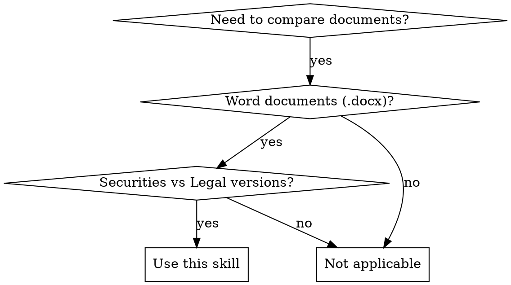

# Document Comparison Skill

## Overview
Automated comparison of securities firm documents with legal counsel documents for disclosure purposes. Identifies substantive differences, compliance risks, and generates detailed audit reports with risk assessment.

## When to Use


**Use this skill when:**
- Comparing IPO prospectuses, due diligence reports, announcements
- One version from securities firm, one from legal counsel
- Documents are Word (.docx) format with complex structures
- Need to identify substantive differences (not just formatting)
- Compliance verification required
- Need detailed audit reports with risk levels

**Do NOT use when:**
- Comparing different document types (e.g., PDF to Word)
- Documents are not legal/disclosure related
- Only need simple diff (use git diff or standard diff tools)
- No semantic analysis needed (use text comparison tools)

## Comparison Modes

| Mode | Description | Use Case |
|------|-------------|----------|
| **substantive** | LLM-powered semantic analysis | Recommended - identifies differences affecting rights, obligations, risks |
| **strict** | Character-by-character comparison | Absolute consistency required (legal clauses, commitment letters) |
| **compliance** | Legal counsel as standard | Verify securities firm version doesn't introduce compliance risks |

## Quick Reference

```python
from document_compare import DocumentComparison

# Substantive difference mode (recommended)
comparison = DocumentComparison(mode='substantive')
result = comparison.compare(
    doc1_path='securities_firm.docx',
    doc2_path='legal_counsel.docx'
)

# Save report
comparison.compare_and_save(
    doc1_path='securities_firm.docx',
    doc2_path='legal_counsel.docx',
    output_path='comparison_report.md'
)
```

## Risk Levels

- 🔴 **High**: Substantive legal changes (rights/obligations modified, warranties weakened)
- 🟡 **Medium**: Numeric differences, important but non-legal changes
- 🟢 **Low**: Minor wording, synonyms, formatting changes

## Implementation

**Core Components:**
- `DocumentParser`: Parse Word documents (paragraphs, tables, lists)
- `AlignmentEngine`: Align document structures across versions
- `DocumentComparator`: Three comparison modes with LLM analysis
- `ReportGenerator`: Markdown/JSON/HTML reports with risk assessment

**Dependencies:** python-docx, scikit-learn, langchain, openai

**File Location:** `skills/document-comparison/document_compare.py`

## Common Mistakes

| Mistake | Why It's Wrong | Fix |
|---------|----------------|-----|
| Using strict mode for all comparisons | Flags trivial differences (synonyms, formatting) | Use substantive mode for most cases |
| Not reviewing high-risk differences | Manual verification essential | Always review 🔴 marked items |
| Ignoring orphan paragraphs | May contain deleted/added content | Check alignment results for unmatched paragraphs |
| Not configuring LLM API | Substantive/compliance modes require LLM | Set OPENAI_API_KEY environment variable |

## Example Workflow

```bash
# Install dependencies
pip install -r skills/document-comparison/requirements.txt

# Set LLM API key
export OPENAI_API_KEY="your-key-here"

# Run comparison
python -c "
from document_compare import DocumentComparison
comparison = DocumentComparison(mode='substantive')
result = comparison.compare_and_save(
    doc1_path='path/to/securities_firm.docx',
    doc2_path='path/to/legal_counsel.docx',
    output_path='comparison_report.md',
    output_format='markdown'
)
print(f'Report saved to: {result}')
"
```

## Testing

```bash
cd skills/document-comparison
pytest tests/ -v
```

## Configuration

**Environment Variables:**
- `OPENAI_API_KEY`: Required for substantive and compliance modes

**Custom Rule Library:** Create `skills/document-comparison/rules/custom.yaml` to add domain-specific rules for identifying substantive differences.

## Version

0.1.0
